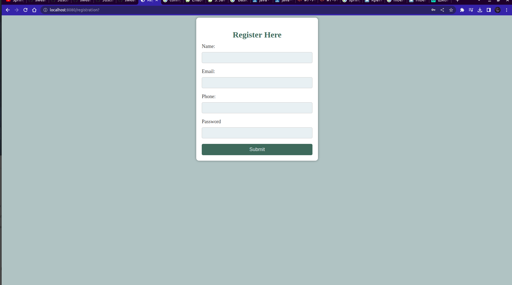

## Веб-сервер на спринге

---

`Для каких нужд этот сервер создается пока останется тайной, но я очень постараюсь`
### Используемые зависимости:
#### Базы данных:
	База данных postgres связана с ООП при помощи фреймворка Hibirnate 
#### Безопасность авторизации:
	 Фреймворк Spring Security предоставляет механизм аунтификации и авторизации
### На данный момент
	Появилась нужда изменить классы шаблонов на freemarker, пришлось пушить...

