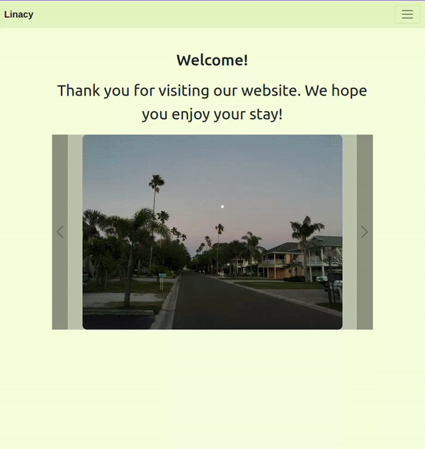

## Веб-сервер на спринге

---

`База веб-сервиса по приобретению экскурсий'
### Используемые зависимости:
#### Базы данных:
	База данных postgres связана с ООП при помощи фреймворка Hibirnate 
#### Безопасность авторизации:
	 Фреймворк Spring Security предоставляет механизм аунтификации и авторизации
### На данный момент
- Возможна полная регистрация с подтверждением по почте
- Возможно редактировать профиль
- Возможно добавлять товыары в корзину (на кукисах)
- Возможно удалять, менять кол-во товара в корзине, отображается сумма заказа
#### Для роли админа:
- Возможен просмотр всех юзеров и удаление отдельных персонажей, возможность наделять ролью админа
- Возможно создание, редактирование и удаление товара

